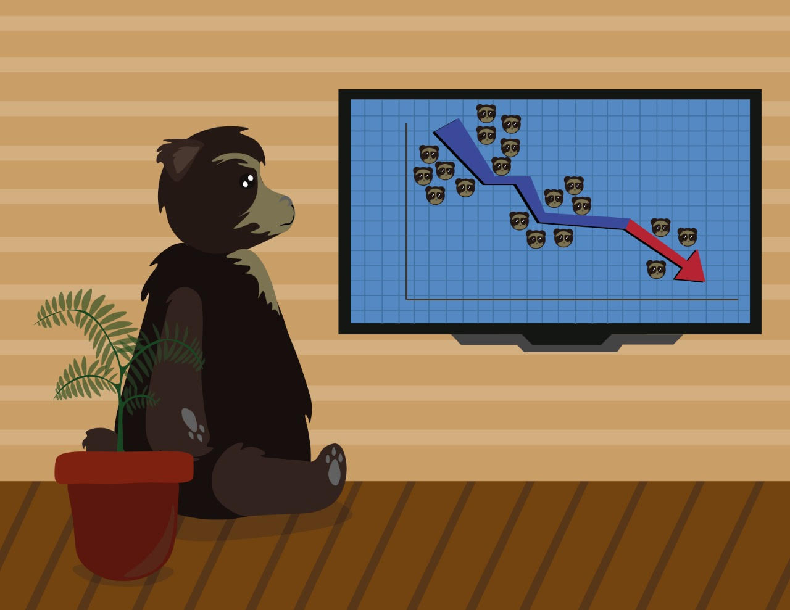

```{r setup, include=FALSE}
knitr::opts_chunk$set(echo = TRUE,
                      warning = FALSE,
                      message = FALSE,
                      fig.align = "center")
```

# Team: *"Extintos"*

```{r, echo=FALSE}

```

# Datos GBIF

## *Cariniana pyriformis*

```{r, cache=TRUE}
# Biblioteca rgbif
library(rgbif)
gbif_cp <- occ_search(scientificName = "Cariniana pyriformis",
                  limit = 5000, return = "data",
                  hasCoordinate = TRUE)

data_cp <- gbif_cp$data
data_cp
```

### Limpieza

- **Propuesta:** App BioCol
- La App sólo utiliza datos para Colombia (inicialmente)
- Filtra coordenadas ausentes.
- Filtra puntos de observación duplicados.
- Para la base de datos final que estará disponible para el usuario, sólo se muestran las variables de interés.

```{r}
library(tidyverse)
library(Hmisc)
data_cp %>% 
  filter(country == "Colombia") %>% 
  filter(!duplicated(decimalLatitude, decimalLongitude)) %>% 
  dplyr::select(scientificName, decimalLatitude, decimalLongitude, kingdom, phylum,
         family, genus, genericName, stateProvince, year, month, day,
         eventDate, class, country, occurrenceRemarks, habitat) %>% 
  mutate(habitat = capitalize(tolower(habitat))) ->
  data_cp_clean
data_cp_clean
```

## *Tremarctos ornatus*

```{r, cache=TRUE}
gbif_to <- occ_search(scientificName = "Tremarctos ornatus",
                  limit = 5000, return = "data",
                  hasCoordinate = TRUE)

data_to <- gbif_to$data
data_to
```

### Limpieza

```{r}
data_to %>% 
  filter(country == "Colombia") %>% 
  filter(!duplicated(decimalLatitude, decimalLongitude)) %>% 
  dplyr::select(scientificName, decimalLatitude, decimalLongitude, kingdom, phylum,
         family, genus, genericName, stateProvince, year, month, day,
         eventDate, class, country, occurrenceRemarks, habitat) %>% 
  mutate(habitat = capitalize(tolower(habitat))) ->
  data_to_clean
data_to_clean
```

# Visualizaciones

- Ejemplos con *Tremarctos ornatus*.

## Mapas

### Mapa Colombia (1)

- **Mapa de Colombia:** obtenido con la biblioteca raster.

```{r}
library(raster)
# colombia0 <- getData(name = "GADM", country = "COL", level = 1, download = TRUE)
colombia <- read_rds("../data/gadm36_COL_1_sp.rds")
data_col <- fortify(colombia, region = "NAME_1")
data_col %>% 
  ggplot(aes(long, lat, group = group)) +
  geom_polygon(fill = "white") + 
  coord_equal() + 
  geom_path(color = "black") +
  theme_void() 
```

### Mapa Colombia (2)

```{r}
library("ggmap")
mapa <- c(left = -85, bottom = -5, right = -66, top = 13)
get_stamenmap(mapa, zoom = 5,
              source = "stamen", maptype = "terrain",
              force = TRUE) %>% ggmap() +
  labs(x = "Longitud", y = "Latitud") +
  scale_size_manual(values = c(0.1, 0.1)) +
  geom_point(data = data_to_clean, aes(x = decimalLongitude, y = decimalLatitude),
             shape = 19)
```

### Mapa Colombia (3)

```{r}
library("ggmap")
get_stamenmap(mapa, zoom = 5,
              source = "stamen", maptype = "terrain",
              force = TRUE) %>% ggmap() +
  geom_polygon(data = data_col, aes(x = long, y = lat, group = group),
               alpha = 0.001) + 
  geom_path(color = "black",
            data = data_col, aes(x = long, y = lat, group = group)) +
  labs(x = "Longitud", y = "Latitud") +
  scale_size_manual(values = c(0.1, 0.1)) +
  geom_point(data = data_to_clean, aes(x = decimalLongitude, y = decimalLatitude),
             shape = 19)
```

## Conteos anuales

```{r}
data_to_clean %>% 
  group_by(year) %>% 
  count() %>% 
  ggplot(aes(x = year, y = n)) +
  geom_line() +
  theme_light()
```

## Conteos mensuales

```{r}
data_to_clean %>% 
  group_by(month) %>% 
  count() %>% 
  ggplot(aes(x = month, y = n)) +
  geom_line() +
  theme_light() +
  scale_x_continuous(breaks = seq(1, 12, 1))
```

## Conteo por departamento

```{r}
data_to_clean %>% 
  group_by(stateProvince) %>% 
  count() %>% 
  filter(!is.na(stateProvince)) %>% 
  ggplot(aes(x = reorder(stateProvince, n), y = n)) +
  geom_col(color = "black") +
  coord_flip() +
  theme_light() +
  labs(x = "Departamento", y = "Total") +
  scale_y_continuous(breaks = seq(1, 61, 10))
```

## Zona de vida

```{r}
data_to_clean %>% 
  group_by(habitat) %>% 
  count() %>% 
  filter(!is.na(habitat)) %>% 
  ggplot(aes(x = reorder(habitat, n), y = n)) +
  geom_col(color = "black") +
  coord_flip() +
  theme_light() +
  labs(x = "Zona de vida", y = "Total") +
  scale_y_continuous(breaks = seq(1, 61, 10))
```

## Nubes de palabras

### Descripción de observación

```{r}
# Tokenización de texto
library(tidytext)
source("../functions/tokenizar.R")

# Función cleanText() 
texto <- data_to_clean %>% 
  filter(!is.na(occurrenceRemarks)) %>% 
  mutate(textTokenize = map(.x = occurrenceRemarks,
                            .f = cleanText))
# Texto tidy (ordenado)
texto_tidy <- texto %>%
  unnest(cols = textTokenize) %>% 
  rename(token = textTokenize)

# Frecuencia de palabras
freq_texto <- texto_tidy %>% 
  group_by(token) %>% 
  summarise(frequence = n())

# nube de palabras
library(wordcloud)
wordcloudCustom <- function(data){
  wordcloud(words = data$token, freq = data$frequence,
            max.words = 400, random.order = FALSE, rot.per = 0.35,
            colors = jcolors(palette = "pal9"))
}

library(jcolors)
wordcloudCustom(data = freq_texto)
```


### Hábitat

```{r}
# Función cleanText() 
texto2 <- data_to_clean %>% 
  filter(!is.na(habitat)) %>% 
  mutate(textTokenize = map(.x = habitat,
                            .f = cleanText))
# Texto tidy (ordenado)
texto_tidy2 <- texto2 %>%
  unnest(cols = textTokenize) %>% 
  rename(token = textTokenize)

# Frecuencia de palabras
freq_texto2 <- texto_tidy2 %>% 
  group_by(token) %>% 
  summarise(frequence = n())

wordcloudCustom(data = freq_texto2)
```

# Ambientales

## Imágenes CHELSA + NASA

```{r}
# Cargando bibliotecas
library(tidyverse)
library(raster)
library(biomod2)

# Lista de archivos tif
lista_tif <- list.files("../data/chelsa_climate/", pattern = ".tif$", full.names = TRUE)

# Ordenando la lista
# Esto lo hago pensando en gráficos que están más adelante
lista_tif <- c(lista_tif[1], lista_tif[12:19], lista_tif[2:11])


# Importando imágenes individuales
# Se alamacenan en una lista de nombre chelsa
chelsa <- list()
for (i in 1:length(lista_tif)) {
  chelsa[[i]] = raster(lista_tif[i])
}

# Stack de raster
predictoras <- stack(chelsa[[1]], chelsa[[2]], chelsa[[3]], chelsa[[4]],
                     chelsa[[5]], chelsa[[6]], chelsa[[7]], chelsa[[8]],
                     chelsa[[9]], chelsa[[10]], chelsa[[11]], chelsa[[12]],
                     chelsa[[13]], chelsa[[14]], chelsa[[15]], chelsa[[16]],
                     chelsa[[17]], chelsa[[18]], chelsa[[19]])
plot(predictoras)
```

## Pseudo-Ausencias

```{r}
library(dismo)

# Coordenadas de las ocurrencias
xmin <- min(data_to_clean$decimalLongitude)
xmax <- max(data_to_clean$decimalLongitude)
ymin <- min(data_to_clean$decimalLatitude)
ymax <- max(data_to_clean$decimalLatitude)

# Formando la "caja" de muestreo
bb <- matrix(c(xmin, xmin, xmax, xmax, xmin, ymin, ymax, ymax, ymin, ymin),
             ncol=2)

# Transformando la matriz en SpatialPolygons
bgExt <- sp::SpatialPolygons(list(sp::Polygons(list(sp::Polygon(bb)), 1)))

# Extendiendo 3 grados la zona de muestreo desde los puntos
bgExt <- rgeos::gBuffer(bgExt, width = 3)


# Corte de imágnes chelsa 
envsBgCrop <- raster::crop(predictoras, bgExt)
envsBgMsk <- raster::mask(envsBgCrop, bgExt)

# Muestreo aleatorio de pseudo-ausencias
set.seed(123)
bg.xy <- dismo::randomPoints(envsBgMsk, 1000)

# Matriz de coordenadas a data frame --> nueva variable "target"
bg.xy <- as.data.frame(bg.xy) %>% 
  rename(decimalLongitude = x, decimalLatitude = y) %>% 
  mutate(target = 0)
bg.xy
```

## Unión de presencias y pseudo-ausencias

```{r}
# Base de datos con "1" y "0"
data_to_clean %>% 
  mutate(target = 1) %>% 
  bind_rows(bg.xy) %>% 
  dplyr::select(decimalLatitude, decimalLongitude, target) ->
  data_to_final
data_to_final
```

- **Unión de presencias/ausencias con variables ambientales (raster-tif):**

```{r}
library(biomod2)
# Datos para base de datos de modelos
rta <- data_to_final$target
coord_rta = data_to_final[c('decimalLongitude','decimalLatitude')]
nombre_rta = "Tremarcto_ornatus"

# Formato de base de datos para modelo
datos_modelos <- BIOMOD_FormatingData(
  resp.var = rta,
  expl.var = predictoras,
  resp.xy = coord_rta,
  resp.name = nombre_rta,
  
)
```

- **Extracción de base de datos para modelos y visualización:**

```{r}
# Extracción de base de datos
df_Tremarcto_ornatus <- datos_modelos@coord %>% 
  bind_cols(datos_modelos@data.env.var) %>% 
  bind_cols(as.data.frame(datos_modelos@data.species))

# Cambiando nombres
names(df_Tremarcto_ornatus) <- c("long", "lat", paste0("Bio", 1:19), "target")
df_Tremarcto_ornatus
```
## Exportando data final

```{r, eval=FALSE}
save(df_Tremarcto_ornatus, file = "../data/data_Tremarcto_ornatus.Rdata",
     compress = "xz")
```

# Visualización data final

## Curvas de respuesta logística

```{r}
modelo1 <- glm(target ~Bio1 + Bio2,
               data = df_Tremarcto_ornatus, family = "binomial")
library(ggiraphExtra)
ggPredict(modelo1, jitter = FALSE, colorn = 10, se = F) +
  theme_bw() +
  labs(x = "Bio1", y = "Probabilidad", color = "Bio2")
```

## Distribuciones

```{r, fig.width=9, fig.height=6}
df_Tremarcto_ornatus %>% 
  dplyr::select(-c(long, lat)) %>% 
  gather(key = "key", value = "value", -target) %>% 
  ggplot(aes(x = value, fill = as.factor(target))) +
  facet_wrap(~key, scales = "free") +
  geom_density(alpha = 0.8, ncol = 4) +
  theme_light() +
  labs(fill = "") +
  scale_fill_jcolors(palette = "pal7")
```

## Correlaciones

```{r, fig.height=7, fig.width=9}
library(corrplot)
df_Tremarcto_ornatus %>% 
  dplyr::select(-c(long, lat, target)) %>%
  cor(method = "spearman") %>% 
  corrplot(method = "pie",
           diag = FALSE,
           addgrid.col = "black",
           type = "lower",
           tl.srt = 20,
           tl.col = "black",
           col = jcolors(palette = "pal4"),
           order = "hclust")
```

## Componentes principales

```{r}
library(FactoMineR)
data_acp <- df_Tremarcto_ornatus %>% 
  dplyr::select(-c(long, lat, target))
acp_oso <- PCA(X = data_acp,
               scale.unit = TRUE, 
               ncp = ncol(data_acp),
               graph = FALSE)
summary(acp_oso)
```

### CP1 vs CP2

```{r}
# Añadiendo datos a la base de datos inicial para gráficos ACP
df_Tremarcto_ornatus$cp1 <- acp_oso$ind$coord[, 1]
df_Tremarcto_ornatus$cp2 <- acp_oso$ind$coord[, 2]
df_Tremarcto_ornatus$cp3 <- acp_oso$ind$coord[, 3]

# Variables e Individuos
library(ggpubr)
library(factoextra)
ggarrange(
  fviz_pca_var(X = acp_oso, axes = c(1, 2), select.var = list(cos2 = 0.5)) +
  ggtitle(""),
  
  df_Tremarcto_ornatus %>% 
  ggplot(data =., aes(x = cp1, y = cp2, color = factor(target))) +
  geom_point(size = 2, alpha = 0.7) +
  geom_vline(xintercept = 0, lty = 2, size = 0.3, color = "darkred") +
  geom_hline(yintercept = 0, lty = 2, size = 0.3, color = "darkred") +
  labs(title = "CP1 vs CP2", color = "G. interrupta") +
  scale_color_jcolors(palette = "pal7") +
  theme_light() +
  theme(legend.position = "top"),
  
  ncol = 2
)
```


### CP1, CP2, CP3

```{r}
library(plotly)
plot_ly(df_Tremarcto_ornatus,
        x = ~ cp1,
        y = ~ cp2,
        z = ~ cp3,
        color = ~factor(target),
        colors = c("blue", "red")) %>% 
  add_markers()
```


# Modelos

### Partición de datos

```{r}
# Data para modelos
data_modelo1 <- df_Tremarcto_ornatus %>% 
  dplyr::select(-c(cp1:cp3))

# Cambiando 0 por "No" y 1 por "Si"
data_modelo2 <- data_modelo1 %>% 
  mutate(target2 = factor(target, labels  = c("No", "Si")))
data_modelo3 <- as.data.frame(data_modelo2)

# Partición de datos
library(caret)
set.seed(123)
idx <- createDataPartition(y = data_modelo3$target2, times = 1, p = 0.70, list = FALSE)
dataTrain <- data_modelo3[idx, ]
dataTesti <- data_modelo3[-idx, ]
```

### Exportando predictoras


```{r, eval=FALSE}
# Creando base de datos con predictoras
dataPredictoras <- as.data.frame(coordinates(envsBgMsk))
dataPredictoras$Bio1 <- as.vector(values(envsBgMsk[[1]]))
dataPredictoras$Bio2 <- as.vector(values(envsBgMsk[[2]]))
dataPredictoras$Bio3 <- as.vector(values(envsBgMsk[[3]]))
dataPredictoras$Bio4 <- as.vector(values(envsBgMsk[[4]]))
dataPredictoras$Bio5 <- as.vector(values(envsBgMsk[[5]]))
dataPredictoras$Bio6 <- as.vector(values(envsBgMsk[[6]]))
dataPredictoras$Bio7 <- as.vector(values(envsBgMsk[[7]]))
dataPredictoras$Bio8 <- as.vector(values(envsBgMsk[[8]]))
dataPredictoras$Bio9 <- as.vector(values(envsBgMsk[[9]]))
dataPredictoras$Bio10 <- as.vector(values(envsBgMsk[[10]]))
dataPredictoras$Bio11 <- as.vector(values(envsBgMsk[[11]]))
dataPredictoras$Bio12 <- as.vector(values(envsBgMsk[[12]]))
dataPredictoras$Bio13 <- as.vector(values(envsBgMsk[[13]]))
dataPredictoras$Bio14 <- as.vector(values(envsBgMsk[[14]]))
dataPredictoras$Bio15 <- as.vector(values(envsBgMsk[[15]]))
dataPredictoras$Bio16 <- as.vector(values(envsBgMsk[[16]]))
dataPredictoras$Bio17 <- as.vector(values(envsBgMsk[[17]]))
dataPredictoras$Bio18 <- as.vector(values(envsBgMsk[[18]]))
dataPredictoras$Bio19 <- as.vector(values(envsBgMsk[[19]]))

# Liberando memoria RAM
gc()

# Cambiando nombres
names(dataPredictoras) <- c("long", "lat", paste0("Bio", 1:19))

# Eliminando NAs para predicciones
dataPredictoras <- na.omit(dataPredictoras)

dataPredictoras

save(dataPredictoras, file = "../data/chelsa.Rdata", compress = "xz")
```

### Modelo Random Forest

```{r}
# Bibliotecas
library(caret)
library(recipes)
library(xgboost)
library(doParallel)

# PARALELIZACIÓN DE PROCESO
#===============================================================================
cl <- makePSOCKcluster(5)
registerDoParallel(cl)

# HIPERPARÁMETROS, NÚMERO DE REPETICIONES Y SEMILLAS PARA CADA REPETICIÓN
#===============================================================================
particiones  <- 5
repeticiones <- 3

# Hiperparámetros
hiperparametros <- expand.grid(mtry = c(3, 5, 10),
                               min.node.size = c(2, 5, 15, 30),
                               splitrule = "gini")

set.seed(1992)
seeds <- vector(mode = "list", length = (particiones * repeticiones) + 1)
for (i in 1:(particiones * repeticiones)) {
  seeds[[i]] <- sample.int(1000, nrow(hiperparametros))
}
seeds[[(particiones * repeticiones) + 1]] <- sample.int(1000, 1)

# DEFINICIÓN DEL ENTRENAMIENTO
#===============================================================================
control_train <- trainControl(method = "repeatedcv", number = particiones,
                              repeats = repeticiones, seeds = seeds,
                              returnResamp = "final", verboseIter = FALSE,
                              allowParallel = TRUE, classProbs = TRUE)

# AJUSTE DEL MODELO
# ==============================================================================
set.seed(1992)
modelo_rf1 <- train(target2 ~ .,
                    data = dataTrain %>% select(-target),
                    method = "ranger",
                    tuneGrid = hiperparametros,
                    metric = "Accuracy",
                    trControl = control_train,
                    num.trees = 500)
## When you are done:
stopCluster(cl)

modelo_rf1
```

### Matriz de Confusión

```{r}
# Predicciones en test
predict_rf1 <- predict(object = modelo_rf1, newdata = dataTesti)

# Matriz de confusión
confusionMatrix(data = predict_rf1, reference = dataTesti$target2,
                positive = "Si", dnn = c("Predicho", "Real"))
```


### Exportando modelo

```{r}
saveRDS(object = modelo_rf1, file = "../models/rf.rds", compress = "xz")
```

# Predicciones

## Predicción con Random Forest


```{r}
load("../data/chelsa.Rdata")
modRF1 <- readRDS(file = "../models/rf.rds")
predicciones <- predict(object = modRF1,
                        newdata = dataPredictoras,
                        type = "prob")
```

- **Probabilidades predichas:**

```{r}
dataPredicciones <- data.frame(
  long = dataPredictoras$long,
  lat = dataPredictoras$lat,
  prob = predicciones$Si
)
dataPredicciones
```

## Mapa de predicción 2

```{r}
library(rnaturalearth)
countries <- ne_countries(scale=110)

ggplot() + 
  geom_polygon(data = countries, aes(x = long, y = lat, group = group),
               color = "black", lwd = .25, fill = "white", alpha = 0.2) +
  scale_y_continuous(limits = c(-10, 13)) +
  scale_x_continuous(limits = c(-85, -60)) +
  geom_tile(data = dataPredicciones,
              aes(fill = prob, x = long, y = lat), alpha = 0.8) +
  scale_fill_gradient2("Probability",
                       low = "#ffffbf", mid = "#1a9641", high = "#d7191c",
                       midpoint = 0.5) +
  theme_void() +
  labs(fill = "Probabilidad")
    
```

# Recursos de información

- https://access.earthdata.nasa.gov/datasets/C1579029605-SCIOPS?action=index&controller=datasets&dataset_page_num=3240&dataset_page_size=10&keyword=%2A

- Instituto Humboldt: http://www.humboldt.org.co/es/boletines-y-comunicados/item/1087-biodiversidad-colombiana-numero-tener-en-cuenta


- National Geographic Society. (2019). Conservation. National Geographic. https://www.nationalgeographic.org/encyclopedia/conservation/?utm_source=BibblioRCM_Row

- Rutledge, K. et al., 2011. Endangered species. National Geographic. https://www.nationalgeographic.org/encyclopedia/endangered-species/


- https://rspatial.org/

- https://besjournals.onlinelibrary.wiley.com/doi/10.1111/j.2041-210X.2011.00172.x

- https://onlinelibrary.wiley.com/doi/10.1111/aec.12658

- https://www.ncbi.nlm.nih.gov/pmc/articles/PMC6441032/

- https://www.ncbi.nlm.nih.gov/pmc/articles/PMC6812352/


- https://www.car.gov.co/uploads/files/5bd8b7fe8125c.pdf

- https://core.ac.uk/download/pdf/11058436.pdf

- https://www.car.gov.co/uploads/files/5c4649693d7f8.pdf

- https://repository.javeriana.edu.co/bitstream/handle/10554/34046/TESIS%20JESSICA%20ARIAS.pdf?sequence=1&isAllowed=y